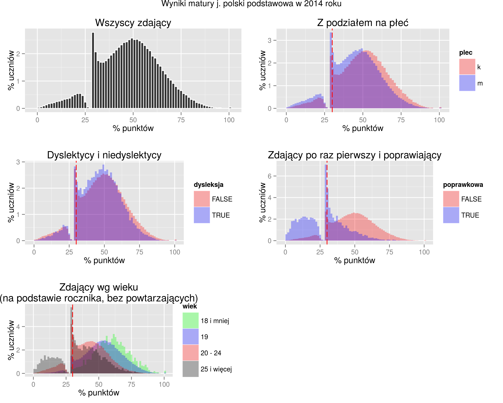
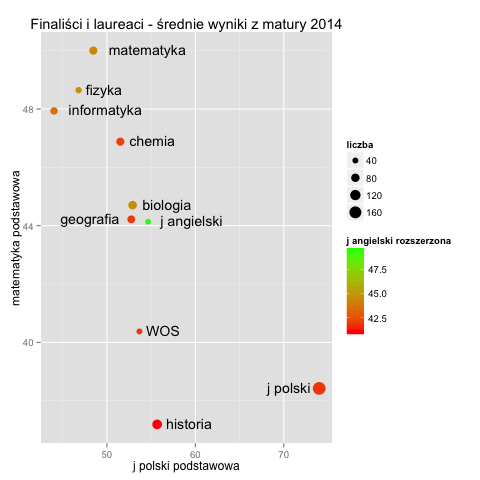

# delab-matury

Piotr Migdał, Marta Czarnocka-Cieciura

Analiza danych maturalnych z lat 2010-2014, związana z projektem [Analiza i wizualizacja danych maturalnych](http://www.delab.uw.edu.pl/strefa-badania/program-spoleczny-jsf/matura), przeprowadzonego w ramach [DELab Uniwersytetu Warszawskiego](http://www.delab.uw.edu.pl/). 

Główne interaktywne wizualizcje są przedstawione tu:

* http://stared.github.io/delab-matury/koincydencje
* http://stared.github.io/delab-matury/wojewodztwa
* https://matury.shinyapps.io/histogramy

Dane pochodzą z Zespołu Pomiaru Dydaktycznego [Instytutu Badań Edukacyjnych](http://www.ibe.edu.pl), przez [pakiet R zozlak/ZPD](https://github.com/zozlak/ZPD). 

