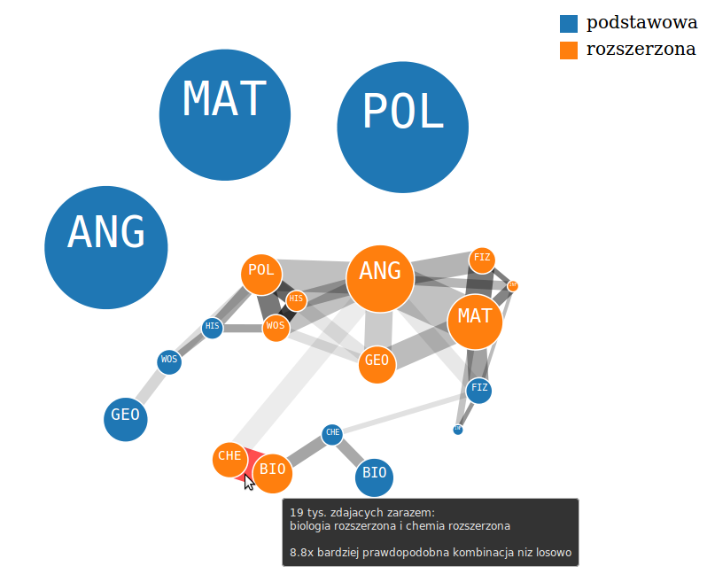
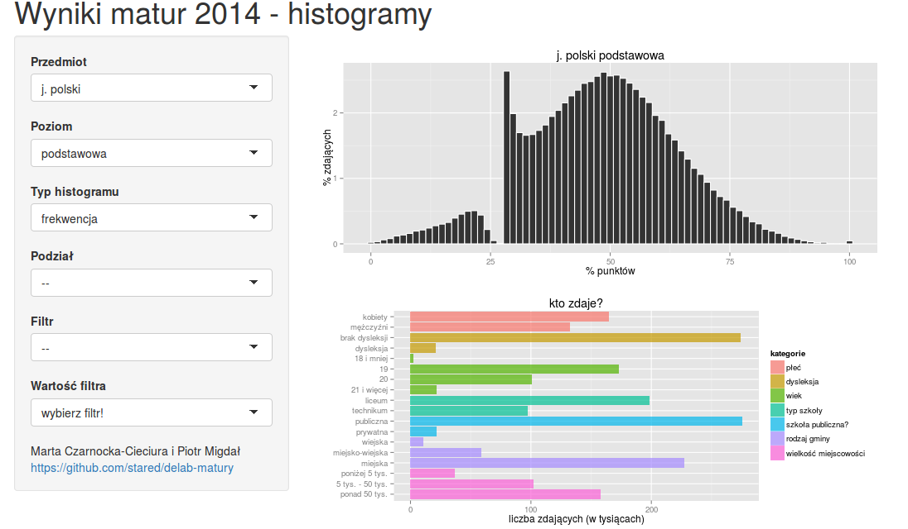
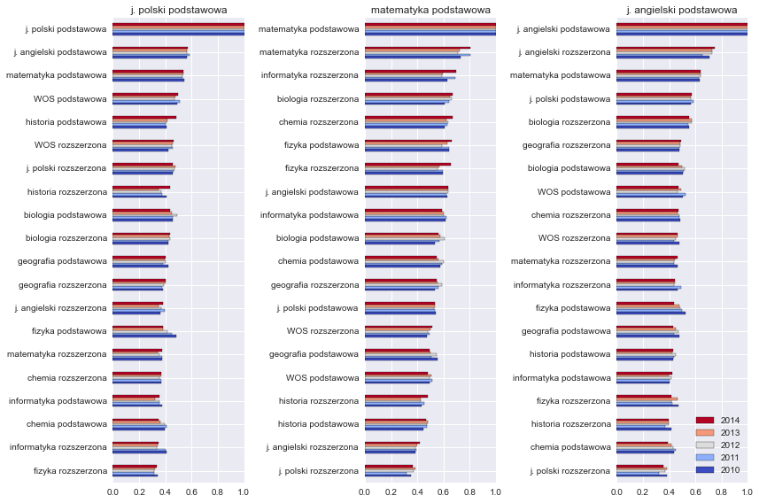
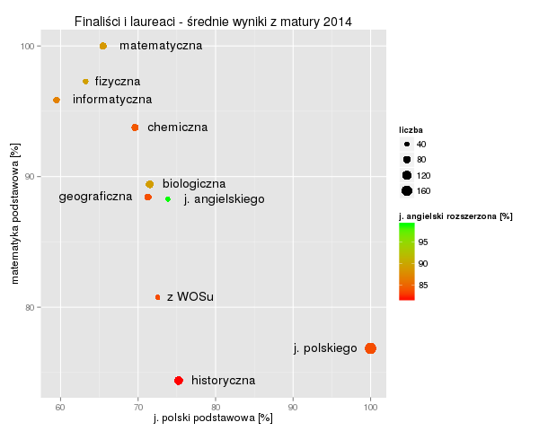
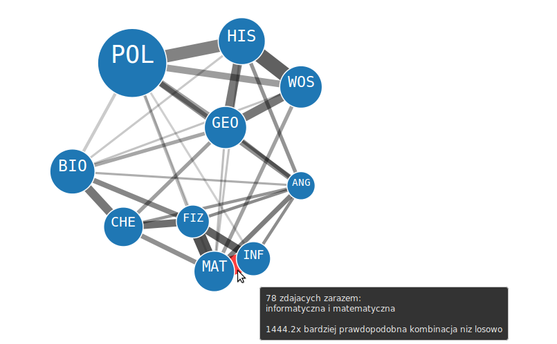
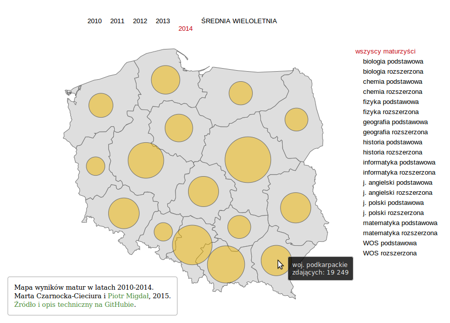

```{r echo=FALSE}
## komentarze
```

```{r include=FALSE}
# histogramy
source('histogramy.r')

# automatyczna numeracja rycin
library(kfigr)

# caption
caption <- function(label, text){
cat("\n")  
cat(paste0("\nRyc. ", figr(label), ": ",
           text))
 cat("<p> </p>")  
}
  
```

# Abstrakt

Niniejszy raport przedstawia wyniki uzyskane w mikrograncie DELab UW "Analiza i interaktywna wizualizacja danych maturalnych", realizowanym w okresie kwiecień-lipiec 2015. Przeanalizowano dane maturalne z lat 2010-2014 pochodzące ze zbioru Zespołu Pomiaru Dydaktycznego Instytutu Badań Edukacyjnych. W niniejszym raporcie zaprezentowano główne wyniki oraz opisano stworzone wizualizacje: wspólnego wybierania matur, rozkładów wyników w zależności od czynników demograficznych i własności szkół średnich, porównania wyników między województwami oraz uczestnictwa w olimpiadach przedmiotowych i ich związek z wynikami matur. 

# Wstęp

Egzamin maturalny jest testem uprawniającym do aplikacji na studia wyższe. Przystępują do niego niemal wszyscy absolwenci liceów oraz wielu absolwentów innych szkół ponadgimnazjalnych z całego kraju. Tym samym dane związane z maturami są istotnym źródłem dla przekrojowej analizy edukacji przedakademickiej w Polsce, której wyniki można porównać z innymi miarami zdolności i wiedzy [`r figr("sciezki_2013", type="reference")`].

Korzystając z danych maturalnych można nie tylko prześledzić bezpośrednie wyniki, ale też wyciągnąć wnioski dotyczące efektywnych możliwości edukacyjnych danej szkoły czy regionu. Co więcej, pozwalają one porównać egzaminy maturalne z różnych przedmiotów między sobą, a także z innymi wynikami edukacyjnymi.

Projekt przewidywał przeanalizowanie danych z matur z lat 2010-2014, składających się ze zanonimizowanych wyników z każdego zadania dla 10 najczęściej zdawanych przedmiotów, połączonych z dodatkowymi informacjami o maturzystach i ukończonych przez nich szkołach [`r figr("ZPD", type="reference")`]. Pozwoliło to zbadać, jakie czynniki wpływają na wyniki matur. Umożliwiło też analizę zróżnicowania geograficznego uzyskanych wyników, a także zbadanie wyboru przedmiotów dokonanego przez maturzystów.

W ramach projektu przeanalizowano również dane dotyczące finalistów i laureatów olimpiad przedmiotowych. Zbadano, jak radzili sobie z obowiązkowymi przedmiotami maturalnymi oraz czy i które z tych konkursów były najczęściej łączone.

Mniej uwagi poświęcono natomiast kwestii zdawalności poszczególnych matur. Po pierwsze, jest to zagadnienie szeroko omawiane w innych opracowaniach, na przykład raportach Centralnej Komisji egzaminacyjnej [`r figr("CKE_2014", type="reference")`]. Oprócz tego liczba uzyskanych punktów dostarcza więcej informacji zwrotnej na temat umiejętności i przygotowania maturzysty niż zero-jedynkowe stwierdzenie, czy zdał lub nie.

Głównym celem projektu było przedstawienie danych maturalnych w postaci interaktywnych wizualizacji, które pozwalają na eksplorację danych i wyciąganie z nich wniosków. Umożliwiają również atrakcyjne przedstawienie wyników, przystępne także dla osób mniej obeznanych z technikami analizy danych.

## Wybrane spostrzeżenia

* Więcej kobiet niż mężczyzn przystąpiło do pisania matury.

* Kobiety częściej niż mężczyźni wybierały przedmioty przyrodnicze: biologię i chemię, a także WOS na obu poziomach i rozszerzony język polski.

* Mężczyźni częściej niż kobiety wybierali przedmioty ścisłe (informatykę i fizykę na obu poziomach, rozszerzoną matematykę), a także historię na obu poziomach i podstawową geografię.

* Wśród przedmiotów do wyboru na maturze widać trzy grupy wspólnie wybieranych: humanistyczno-społeczne, ścisłe i przyrodnicze. Rozszerzony język angielski był często łączony z przedmiotami rozszerzonymi z wszystkich trzech grup.

* Mężczyźni częściej niż kobiety uzyskiwali bardzo dobre wyniki z angielskiego, geografii i historii na obu poziomach oraz z biologii, chemii i WOS-u na poziomie rozszerzonym. 

* Kobiety częściej niż mężczyźni uzyskiwały bardzo dobre wyniki z języka polskiego na obu poziomach oraz z podstawowych przedmiotów przyrodniczych: biologii, chemii i fizyki.

* Mężczyźni w porównaniu z kobietami mieli bardziej zróżnicowane wyniki z podstawowego WOS-u i rozszerzonych przedmiotów ścisłych: fizyki i matematyki (większy odsetek najlepszych i najsłabszych wyników).

* Dyslektycy radzili sobie podobnie lub nieco gorzej niż pozostali zdający, ale równocześnie nieco mniejszy ich odsetek miał najsłabsze wyniki.

* Wiek maturzysty silnie negatywnie korelował z wynikami matur. W szczególności osoby o rok młodsze niż większość maturzystów uzyskały wyniki znacznie powyżej średniej.

* Maturzyści kończący szkoły publiczne mieli częściej dobre wyniki niż kończący niepubliczne.

* Absolwenci liceów ogólnokształcących częściej uzyskiwali dobre wyniki niż absolwenci pozostałych szkół.

* Absolwenci szkół średnich w gminach wiejskich i miejsko-wiejskich częściej uzyskiwali słabe wyniki niż absolwenci szkół w gminach miejskich.

* Wielkość miejscowości, w której znajdowała się szkoła pozytywnie korelowała z wynikami matur.

* Laureaci i finaliści wszystkich olimpiad przedmiotowych mieli średnio wyższe od przeciętnych wyniki z obowiązkowych matur.

* Nie widać wyraźnych ogólnych trendów przestrzennych w zróżnicowaniu wyników matur między województwami. 

* Zaburzenia w okolicy progu zdawalności (30%) były najbardziej wyraźne dla języka polskiego podstawowego, ale były widoczne też w rozkładzie wyników matur z podstawowej matematyki i języka angielskiego.

# Wyniki

## Wspólnie wybierane przedmioty

Online: http://stared.github.io/delab-matury/koincydencje/, opcja „matury2014”.

Jednym z celów niniejszego projektu było zbadanie, jakie przedmioty są wybierane i łączone przez maturzystów. Decyzję taką musiał podjąć każdy zdający, ponieważ oprócz obowiązkowych matur z języka polskiego, matematyki i języka obcego na poziomie podstawowym, każdy maturzysta musiał wybrać od jednego do 4 lub 6 innych egzaminów (§54, Rozporządzenie Ministra Edukacji Narodowej z dnia 30 kwietnia 2007 roku [`r figr("MEN_2007", type="reference")`] i §1 pkt 23, rozporządzenie Ministra Edukacji Narodowej z dnia 25 kwietnia 2013 roku [`r figr("MEN_2013", type="reference")`]).

```{r graf_matury, echo = F, results = 'asis', anchor="figure"}
cat("")

caption('graf_matury', "Zrzut ekranu: interaktywny graf wspólnie wybieranych egzaminów w 2014 roku.")
```

Do przeanalizowania tego tematu wykorzystano graf, czyli formę wizualizacji przedstawiającą dane za pomocą wierzchołków i łączących je krawędzi (ryc. `r figr("graf_matury", type="figure")`). Powierzchnia kół stanowiących wierzchołki grafu odpowiada liczbie maturzystów zdających dany egzamin w 2014 roku. Kolor wierzchołka symbolizuje poziom egzaminu: niebieski odpowiada maturom podstawowym, pomarańczowy – rozszerzonym. Grubość połączeń między dwoma węzłami odpowiada pierwiastkowi z liczby maturzystów, którzy wybrali obydwa te przedmioty. 

Gdyby maturzyści wybierali niezależnie każdy z egzaminów, wówczas należałoby się spodziewać, że liczba osób zdających równocześnie maturę X i Y ($n_{XY}$) powinna wynosić
$$
n_{XY} = \frac{n_X}{n}\frac{n_Y}{n} n
$$
Gdzie $n_X$ i $n_Y$ to odpowiednio liczba maturzystów zdających egzamin X i Y, natomiast $n$ to liczba wszystkich maturzystów w 2014 roku. Miarą współwystępowania przedmiotów jest to, ile razy częściej (lub rzadziej) były one wybierane wspólnie w porównaniu z $n_{XY}$. Aby zwiększyć czytelność wizualizacji, na grafie przedstawiono tylko połączenia pomiędzy przedmiotami wybieranymi częściej niż losowo, przy czym im ciemniejsza krawędź, tym częściej przedmioty stanowiące jej wierzchołki były wspólnie wybierane.

Omawiana wizualizacja jest interaktywna. Po najechaniu kursorem na wybrany wierzchołek można uzyskać o nim dodatkowe informacje: pełną nazwę egzaminu oraz liczbę zdających go maturzystów. Podobnie w przypadku krawędzi: ukazuje się informacja o obydwu połączonych przedmiotach, liczbie maturzystów wybierających równocześnie oba egzaminy oraz wspomniana wyżej miara, o ile częściej są one wybierane wspólnie w porównaniu z modelem losowym. Można również przesuwać kursorem wierzchołki, aby lepiej przyjrzeć się połączeniom w grafie.

Wizualizacja została napisana w języku *JavaScript* przy użyciu biblioteki do wizualizacji danych *D3.js* [`r figr("d3js", type="reference")`].

### Obserwacje

Najczęściej wybieranymi przedmiotami są, jak łatwo się domyślić, matury obowiązkowe: język polski i matematyka na poziomie podstawowym oraz język angielski – najbardziej popularny obowiązkowy język obcy (88% zdających w 2014 roku, [`r figr("CKE_2014", type="reference")`]). Ponieważ niemal wszyscy maturzyści pisali te trzy egzaminy, więc częstość ich współwystępowania z dowolnym innym przedmiotem jest praktycznie równa teoretycznej losowej wartości. Z tego powodu krawędzie łączące te matury z innymi przedmiotami nie zostały przedstawione na grafie. Jednak sama wielkość wierzchołków odpowiadających trzem obowiązkowym maturom stanowi dobre porównanie, pozwalające ocenić, jak wielu maturzystów zdawało pozostałe przedmioty.

Graf połączeń między przedmiotami do wyboru wyraźnie rozdziela się na trzy grupy silnie powiązanych przedmiotów.

* Przedmioty ścisłe i techniczne. Centrum tej grupy zajmuje rozszerzona matematyka, z którą wspólnie zdawane są  oba poziomy egzaminów z fizyki i informatyki. 

* Przedmioty humanistyczne i społeczne. Centralne miejsce zajmuje tu rozszerzony język polski, a oprócz niego: oba poziomy matury z historii i WOS-u oraz wyraźnie powiązana z tą grupą geografia podstawowa.

* Przedmioty przyrodnicze: chemia i biologia na obu poziomach.

Wspólny „pień” łączący gałęzie ścisło-techniczną i humanistyczno-społeczną stanowią egzaminy rozszerzone z języka angielskiego i (w mniejszym stopniu) z geografii. Przedmioty przyrodnicze stanowią najbardziej izolowaną grupę.

Podział ten może bardziej odpowiadać profilom klas w szkołach średnich albo wymogom stawianym kandydatom przez uczelnie wyższe, niż tylko powiązaniom pomiędzy zainteresowaniami maturzystów. Niestety, tych dwóch hipotez nie udało się zweryfikować ze względu na brak dostępnych informacji o profilu ukończonej klasy i ewentualnych kierunkach studiów wybieranych przez każdego z maturzystów. 

Maturzyści wybierający przedmioty z pierwszej z wymienionych grup to prawdopodobnie osoby, które ukończyły klasy matematyczno-fizyczne i starały się dostać na studia na politechnice lub kierunki ścisłe na uniwersytetach. Druga grupa to osoby zainteresowane kierunkami humanistycznymi oraz kształceniem z zakresu zarządzania i biznesu, z których zapewne większość uczęszczała do klas o profilu humanistycznym. Wreszcie trzecia grupa to prawdopodobnie kandydaci na kierunki medyczne, przyrodnicze lub rolnicze, będący absolwentami z klas biologiczno-chemicznych. Zapewne stosunkowo mało profili klas w szkołach średnich i kierunków studiów oferuje możliwość łączenia tych trzech dziedzin wiedzy.

Warto też spojrzeć na częstość wspólnego wybierania matur na poziomie podstawowym i rozszerzonym. Z większości przedmiotów (oprócz trzech obowiązkowych) maturzyści musieli wybrać zdawanie albo matury rozszerzonej, albo podstawowej. Z tego powodu oba poziomy tego samego przedmiotu nie są ze sobą połączone na grafie. Warto jednak zwrócić uwagę, że przedmioty rozszerzone są na ogół silniej powiązane niż podstawowe. Zwłaszcza rozszerzony język angielski był szczególnie chętnie wybierany przez zdających inne przedmioty na poziomie rozszerzonym. Z kolei przedmioty podstawowe są słabo powiązane i stanowią raczej dalsze odgałęzienia wszystkich trzech gałęzi grafu. 

Być może wśród osób wybierających egzaminy na poziomie podstawowym więcej było osób zdecydowanych zakończyć swoją edukację po zdaniu matury. Tacy maturzyści mogli więc wybrać tylko jeden przedmiot z listy do wyboru i nie musieli przy tym kierować się wymaganiami uczelni wyższych.

## Rozkłady wyników wśród maturzystów

Online: https://matury.shinyapps.io/histogramy

Jednym z celów niniejszego projektu było zbadanie, jak kształtują się i od czego zależą wyniki poszczególnych egzaminów maturalnych. W tym celu można porównać miary tendencji centralnej (np. średnią lub medianę) i zmienności (np. odchylenie standardowe) uzyskanej liczby punktów pomiędzy poszczególnymi grupami maturzystów lub pomiędzy różnymi egzaminami. Jednak bardziej obrazowe i pełniejsze pod względem przedstawionej informacji jest zaprezentowanie całego rozkładu wyników w postaci histogramu. W ten sposób na wykresie słupkowym można przedstawić udział maturzystów, którzy uzyskali wynik w poszczególnych przedziałach punktacji z danego egzaminu. Dzięki temu można zobaczyć między innymi, jakie wyniki były najczęściej uzyskiwane i czy jest tylko jedno takie maksimum oraz jak bardzo skośny jest wykres (więcej wyników słabszych, czy lepszych niż najczęstsze). Można też wykryć zaburzenia w rozkładzie wyników, w postaci mniejszej lub większej liczby maturzystów w którymś z przedziałów punktowych w porównaniu z przewidywaniami wynikającymi z „wygładzonego” rozkładu wyników. Z kolei porównanie kilku histogramów dla różnych grup maturzystów pozwala łatwo znaleźć przedziały punktowe, w których jedna z grup jest częstsza.

```{r shiny_screenshot_jpl_podstawowa, echo = F, results = 'asis', anchor="figure"}
cat("")

caption('shiny_screenshot_jpl_podstawowa', "Zrzut ekranu: interaktywne histogramy wyników matur, na przykładzie egzaminu z języka polskiego na poziomie podstawowym w 2014 roku.")
```

Na potrzeby tego projektu stworzono interaktywną wizualizację, pozwalającą na efektywne porównywanie rozkładów wyników spośród dużej liczby możliwych kombinacji zdawanych egzaminów i różnych grup maturzystów. Wysokość każdego ze słupków w tak utworzonych histogramach reprezentuje odsetek maturzystów, którzy uzyskali dokładnie tyle samo punktów, czyli szerokość każdego słupka wynosi 1 punkt. Jednak dla ułatwienia porównań pomiędzy różnymi przedmiotami (często mającymi różną maksymalną liczbę punktów), na osi poziomej przedstawiono wyniki w procentach.

Na lewo od histogramu znajduje się menu, z którego użytkownik może wybrać różne opcje. Są to przede wszystkim przedmiot i poziom egzaminu (podstawowy lub rozszerzony), z którego wyniki mają zostać zaprezentowane na histogramie. 

Kolejna opcja, *podział*, umożliwia porównanie wyników matury pomiędzy różnymi grupami maturzystów wyróżnionymi na podstawie informacji o każdym ze zdających: płci, wieku, zdiagnozowanej dysleksji lub jej braku. Oprócz tego można też pogrupować zdających na podstawie informacji o ukończonej szkole średniej: jej typie (liceum ogólnokształcące, liceum profilowane lub technikum), informacji, czy była publiczna czy prywatna oraz rodzaju gminy (miejska, miejsko-wiejska lub wiejska) i wielkość miejscowości, w której znajduje się ta szkoła. Podział na takie grupy wybrano, ponieważ autorzy raportu spodziewali się, że pozwoli to rzucić pewne światło na jakość kształcenia w różnych typach szkół, zweryfikować popularne opinie na temat wybranych grup uczniów (np. czy chłopcy mają lepsze od dziewcząt wyniki z przedmiotów ścisłych) oraz określić, czy pewne grupy młodzieży (np. dyslektycy lub osoby z małych miejscowości) nie wymagają większej pomocy, by wyrównać ich szanse edukacyjne. Zmienne te wybrano również ze względu na ich dostępność dla każdego maturzysty w bazie danych Zespołu Pomiaru Dydaktycznego [`r figr("ZPD", type="reference")`] razem z wynikami matur. Po wybraniu jednej z tych kategorii histogram wyników matury zostaje rozbity na kilka kolorowych histogramów, z których każdy przedstawia wyniki innej grupy maturzystów, np. po wybraniu wieku jako zmiennej *podział* można zobaczyć 4 nałożone na siebie histogramy: dla osób w wieku 18 i mniej lat, 19 lat, 20 lat oraz 21 i więcej lat. 

Domyślną opcją jest przedstawianie na osi pionowej frekwencji w poszczególnych grupach, czyli przeskalowanie wysokości histogramów osobno dla każdej z grup. Takie rozwiązanie ułatwia graficzne porównanie wyników między grupami. Załóżmy, że poniżej pewnej liczby punktów słupki reprezentujące częstości pierwszej grupy maturzystów są wyraźnie wyższe, niż drugiej, natomiast powyżej tej liczby punktów tendencje się odwracają i słupki drugiej grupy „wystają” ponad słupki pierwszej. Taki wzorzec można zobaczyć np. porównując wyniki mężczyzn i kobiet z fizyki podstawowej (ryc. `r figr("shiny_fiz_podstawowa_plec", type="figure")`). Oznacza to, że wśród kobiet większy odsetek osób piszących uzyskało dobre wyniki, niż wśród mężczyzn. W tym sensie można stwierdzić, że kobiety lepiej poradziły sobie z tym egzaminem, niż mężczyźni. Interpretując tak uzyskane wyniki należy jednak pamiętać, że zdanie to dotyczy jedynie kobiet i mężczyzn, którzy zdecydowali się zdawać ten konkretny egzamin. Podobnie, jeśli dla pierwszej grupy maturzystów słupki są wyraźnie wyższe (w porównaniu z drugą grupą) zarówno dla bardzo wysokich, jak i dla bardzo niskich wyników, natomiast dla drugiej grupy – są wyższe w porównaniu z pierwszą grupą dla pośrednich wyników, wówczas oznacza to, że pierwsza grupa ma bardzie zróżnicowane wyniki (np. mężczyźni z matematyki rozszerzonej, ryc. `r figr("shiny_mat_rozszerzona_plec", type="figure")`). Określenie „lepsze”, „gorsze” oraz bardziej i mniej „zmienne” będą poniżej, przy opisie obserwacji poczynionych na podstawie wizualizacji histogramów, oznaczały właśnie takie porównywanie rozkładów częstości wyników dla dwóch grup maturzystów.

```{r shiny_fiz_podstawowa_plec, echo=FALSE, warning=FALSE, fig.width=6, fig.height=3, anchor="figure", results = 'asis'}
wykres <- ggHistPodzial("fizyka_podstawowa", "płeć") + theme(text = element_text(size=9))
print(wykres)

caption('shiny_fiz_podstawowa_plec', "Histogram wyników matury z fizyki podstawowej w 2014 roku z podziałem ze względu na płeć zdających.")
```

```{r shiny_mat_rozszerzona_plec, echo=FALSE, warning=FALSE, fig.width=6, fig.height=3, anchor="figure", results = 'asis'}
wykres <- ggHistPodzial("matematyka_rozszerzona", "płeć") + theme(text = element_text(size=9))
print(wykres)

caption('shiny_mat_rozszerzona_plec', "Histogram wyników matury z matematyki rozszerzonej w 2014 roku z podziałem ze względu na płeć zdających.")
```

Jednak przedstawianie jedynie częstości poszczególnych wyników wśród wyróżnionych grup gubi informację o liczebności tychże grup, która może mieć kluczowe znaczenie, jeśli chodzi o wpływ wyników uzyskanych przez grupę na rozkład wyników w całej populacji. Można to uwzględnić w histogramach wybierając opcję *Typ histogramu* = „liczebność”. Równocześnie liczebności wszystkich grup, na które dzielą maturzystów wymienione wyżej kategorie, zostały przedstawione na dodatkowym wykresie słupkowym.

Omówiona wcześniej opcja *podział* nie umożliwia zbadania interakcji zachodzących pomiędzy poszczególnymi kategoriami. Na przykład dwudziestoletni maturzyści mogą być zarówno absolwentami 4 letniego technikum, uczącymi się w normalnym trybie, jak również osobami kończącymi 3 letnie liceum, które miały roczną przerwę na którymś etapie nauki. Aby móc badać takie interakcje np. między kategoriami „wiek” i „typ szkoły” na lewym pasku menu można wybrać dodatkową zmienną nazwaną *filtr*. Umożliwia ona wskazanie kategorii, z której chcemy wybrać interesującą nas grupę uczniów z paska *wartość filtra*. Przykładowo ustawienie zmiennej *filtr* = „wiek” i *wartość filtra* = 20 pozwala na przedstawienie na histogramie wyników matur pisanych wyłącznie przez dwudziestolatków. Wybranie równocześnie zmiennej *podział* = „typ szkoły” umożliwia porównanie rozkładu wyników tej grupy wiekowej między absolwentami liceów i techników.

Do tej wizualizacji użyto danych dotyczących maturzystów zdających maturę po raz pierwszy, ponieważ liczba osób piszących ten egzamin kolejny raz jest stosunkowo niewielka i często brakuje o nich niektórych informacji. Do tworzenia omówionych histogramów potrzeba bardzo szczegółowych danych – ich zbiór jest na tyle duży, że wyraźnie spowalnia wizualizację. Aby ograniczyć czas wczytywania, użyto wyłącznie najświeższych danych, pochodzących z 2014 roku.

Wizualizacja ta została wykonana w *R* z użyciem biblioteki *ggplot2* [`r figr("ggplot2", type="reference")`] służącej do wykonywania wykresów i biblioteki *shiny* [`r figr("shiny", type="reference")`] umożliwiającej tworzenie interaktywnych aplikacji dostępnych z poziomu przeglądarki. 

### Obserwacje

Porównywanie rozkładów wyników matur pomiędzy różnymi przedmiotami i grupami zdających dostarcza więcej informacji niż porównywanie samych średnich – ciekawy jest też kształt wykresu. W przypadku obowiązkowych egzaminów wyróżnia się on charakterystycznym „zębem” w okolicach progu zdania wynoszącego 30%. Jest to szczególnie widoczne w przypadku matury podstawowej z języka polskiego (ryc. `r figr("shiny_screenshot_jpl_podstawowa", type="figure")`). Rozkład wyników tego egzaminu układa się w kształt funkcji Gaussa, zaburzony niedoborem wyników o 1-3 punkty poniżej progu i nadmiarem o 1-2 punkty powyżej. Osób, którym zabrakło 1 punktu do zdania matury jest tylko 23, ilość znikoma w skali całego kraju. W przypadku pozostałych obowiązkowych egzaminów, matematyki (ryc. `r figr("shiny_mat_podstawowa", type="figure")`) i języka angielskiego (najczęściej wybieranego języka obcego) na poziomie podstawowym, również widać pewien niedobór zdających mających tuż poniżej 30% i niewielki nadmiar powyżej, ale jest to dużo mniejsza liczba. Występowanie tego „zęba” jest najprawdopodobniej związane z naciąganiem wyników przez egzaminatorów na korzyść maturzystów. Zapewne zadania z języka polskiego, szczególnie pytania otwarte, pozostawiają większą możliwość takich manipulacji niż zadania z matematyki lub nawet – języka obcego.


```{r shiny_mat_podstawowa, echo=FALSE, warning=FALSE, fig.width=6, fig.height=3, anchor="figure", results = 'asis'}
wykres <- ggHistWszyscy("matematyka_podstawowa") + theme(text = element_text(size=9))
print(wykres)

caption('shiny_mat_podstawowa', "Histogram wyników matury z matematyki podstawowej w 2014 roku.")
```


Porównując wyniki matur pisanych przez kobiety i mężczyzn można w pierwszej kolejności zauważyć, że ogólnie więcej kobiet niż mężczyzn przystąpiło do pisania tego egzaminu (co można sprawdzić porównując proporcję płci dla egzaminów obowiązkowych: matematyki i języka polskiego na poziomie podstawowym, ryc. `r figr("shiny_screenshot_jpl_podstawowa", type="figure")`). Kobiety uzyskały lepsze (w sensie porównywania rozkładów, zobacz wyżej) wyniki od mężczyzn z 4 matur na poziomie podstawowym: biologii, chemii, fizyki (ryc. `r figr("shiny_fiz_podstawowa_plec", type="figure")`) i języka polskiego oraz z jednej na poziomie rozszerzonym – z języka polskiego. Natomiast mężczyźni mieli lepsze od kobiet wyniki z 3 matur na poziomie podstawowym (geografii, historii i języka angielskiego) i aż z 6 na poziomie rozszerzonym (biologia, chemia, geografia, historia, język angielski i WOS). Spośród pozostałych egzaminów, w 3 można zaobserwować większy rozrzut wyników wśród mężczyzn (kobiety miały częściej wyniki w okolicy średniej, mężczyźni – więcej wyników bardzo słabych i bardzo dobrych). Dotyczy to matury podstawowej z WOS-u oraz matur rozszerzonych z fizyki i matematyki (ryc. `r figr("shiny_mat_rozszerzona_plec", type="figure")`). Wyniki matury z matematyki podstawowej przedstawiają bardziej złożony wzorzec. Mężczyźni częściej od kobiet otrzymywali najlepsze wyniki (powyżej 75%), ale też nieco częściej – wyniki w okolicy progu zdawalności. Z kolei więcej kobiet, niż mężczyzn uzyskało wyniki dobre (40-75%) ale też było ich nieco więcej wśród osób z najsłabszymi wynikami, poniżej 15%. W przypadku obu matur z informatyki wydaje się, że wśród zdających obie płcie radziły sobie równie dobrze, ale porównania utrudnia mała liczba kobiet wybierających te egzaminy. 

```{r shiny_inf_rozszerzona_grupy, echo=FALSE, warning=FALSE, fig.width=7, fig.height=4, anchor="figure", results = 'asis'}
wykres <- grupyWykres("informatyka_rozszerzona") + theme(text = element_text(size=9))
print(wykres)

caption('shiny_inf_rozszerzona_grupy', "Liczebności poszczególnych grup wśród maturzystów zdających informatykę rozszerzoną w 2014 roku.")
```


To, czy więcej mężczyzn czy kobiet przystąpiło do danej matury nie zawsze było zgodne z tym, która z płci częściej dostawała z tego przedmiotu dobre wyniki. Porównując liczbę zdających z poszczególnych egzaminów trzeba pamiętać, że ogólnie więcej kobiet niż mężczyzn przystąpiło do pisania matury (ryc. `r figr("shiny_screenshot_jpl_podstawowa", type="figure")`). Kobiety częściej niż mężczyźni wybierały zdawanie rozszerzonej biologii, chemii i WOS-u, mimo, że rzadziej niż mężczyźni otrzymywały z tych przedmiotów dobre wyniki. Maturzystki chętnie wybierały również biologię i chemię podstawową, oraz rozszerzony język polski, z których miały częściej od mężczyzn dobre wyniki. Natomiast z podstawowego WOS-u, częściej wybieranego przez kobiety, żadna z płci nie uzyskała wyraźnie lepszych wyników. Nieco częściej niż kobiety, mężczyźni wybierali zdawanie geografii podstawowej i obu egzaminów z historii – przedmiotów, z których mężczyźni częściej niż kobiety mieli dobre wyniki. Natomiast spośród egzaminów zdecydowanie częściej wybieranych przez mężczyzn, niż kobiety albo żadna z płci nie uzyskała jednoznacznie lepszych wyników (oba egzaminy z informatyki (rozszerzona: ryc. `r figr("shiny_inf_rozszerzona_grupy", type="figure")`), rozszerzona fizyka i matematyka), albo kobiety częściej niż mężczyźni uzyskiwały dobre wyniki (fizyka podstawowa). Przedmioty, które były podobnie często wybierane przez obie płcie to (oprócz obowiązkowych matur) również rozszerzona geografia i język angielski – przedmioty, z których mężczyźni częściej niż kobiety uzyskiwali dobre wyniki.

Porównania wyników dla poszczególnych płci należy interpretować szczególnie ostrożnie: jest to temat delikatny i łatwo o nadinterpretacje dyktowane własnymi poglądami. Trzeba też pamiętać, że w przypadku nieobowiązkowych matur zdający nie są losową próbką z populacji i oprócz wyników trzeba uwzględniać również proporcje zdających. Wybór przedmiotów ścisłych: fizyki, matematyki i informatyki, był częstszy wśród mężczyzn, niż wśród kobiet. Równocześnie jednak kobiety, które zdecydowały się wybrać te egzaminy, uzyskały podobne wyniki, co ich koledzy, a w przypadku podstawowej fizyki – nieco lepsze. Można podejrzewać, że wśród maturzystów dalej funkcjonuje stereotyp, że są to „męskie” przedmioty. Natomiast stereotyp „kobiety-humanistki” raczej nie jest potwierdzany przez wyniki matur. Co prawda z języka polskiego kobiety radziły sobie lepiej, niż mężczyźni i częściej wybierały egzamin rozszerzony, ale już z WOS-u, choć częściej zdawanego przez kobiety niż przez mężczyzn, panowie uzyskiwali porównywalne (poziom podstawowy) albo lepsze wyniki (poziom rozszerzony), niż panie. Z języka angielskiego i z historii mężczyźni również radzili sobie lepiej niż kobiety i wybierali te przedmioty równie często lub nawet częściej, niż kobiety. Podobnie zawiła jest sytuacja z przedmiotami przyrodniczymi: biologia i chemia są częściej wybierane przez kobiety, niż przez mężczyzn, choć maturzystki uzyskują z nich lepsze od maturzystów oceny tylko na poziomie podstawowym. Natomiast geografię nieco częściej wybierali mężczyźni, niż kobiety i częściej niż kobiety uzyskiwali z niej dobre wyniki. 

```{r shiny_mat_podstawowa_dysleksja, echo=FALSE, warning=FALSE, fig.width=6, fig.height=3, anchor="figure", results = 'asis'}
wykres <- ggHistPodzial("matematyka_podstawowa", "dysleksja") + theme(text = element_text(size=9))
print(wykres)

caption('shiny_mat_podstawowa_dysleksja', "Histogram wyników matury z matematyki podstawowej w 2014 roku z podziałem ze względu na dysleksję zdających.")
```


Porównując wyniki matur osób ze stwierdzoną dysleksją i pozostałych, dla większości przedmiotów nie widać różnic. Może być to spowodowane między innymi niewielką liczbą dyslektyków, przez co rozkład ich wyników jest bardziej „poszarpany”, niż dla pozostałych zdających. Różnice widać dopiero w maturach pisanych przez największą liczbę osób: w egzaminach na obu poziomach z języka angielskiego, języka polskiego i matematyki oraz nieco mniej wyraźnie – z rozszerzonej chemii i fizyki. W wymienionych egzaminach na poziomie rozszerzonym dyslektycy częściej radzili sobie gorzej niż pozostali zdający. Wyniki trzech obowiązkowych egzaminów na poziomie podstawowym pokazują bardziej złożony obraz sytuacji. Mianowicie większy odsetek dyslektyków, niż pozostałych uczniów, stanowiły osoby o średnich wynikach, mniejszy natomiast – osoby o najlepszych i  o najgorszych osiągnięciach, co jest najwyraźniej widoczne na przykładzie matury podstawowej z matematyki (ryc. `r figr("shiny_mat_podstawowa_dysleksja", type="figure")`). 

Wyjaśnień tego zjawiska może być kilka. Raczej trudno się spodziewać, by sama dysleksja pomagała w jakiś sposób najsłabszym maturzystom. Możliwe jest, że w niektórych sytuacjach ułatwienia stosowane wobec maturzystów-dyslektyków (możliwość pisania na komputerze zamiast ręcznie lub nieco zmodyfikowane kryteria stosowane przez egzaminatorów przy sprawdzaniu matur – Komunikat Dyrektora Centralnej Komisji Egzaminacyjnej z 30 sierpnia 2013 r. [`r figr("CKE_komunikat_2013", type="reference")`]) mogą stawiać dyslektyków w uprzywilejowanej pozycji w stosunku do pozostałych uczniów. Jest to jednak dość ryzykowne stwierdzenie, zważywszy, że dyslektycy rzadziej mieli dobre wyniki w porównaniu do reszty uczniów, co może w pewien sposób usprawiedliwiać szczególne traktowanie tej grupy. Jenak najbardziej prawdopodobnym wyjaśnieniem wydaje się możliwość istnienia różnic w częstości diagnozowania dysleksji między różnymi grupami uczniów. Jest możliwe, że wśród dzieci zaniedbanych, z trudnych rodzin lub po prostu z małych miejscowości dysleksja może być rzadziej diagnozowana. W ten sposób zdający oznaczeni jako dyslektycy mogą stanowić bardzo nielosową grupę i nie zawierać osób z trudnych środowisk, które często mają też problemy z nauką. Co prawda w dostępnych danych nie ma informacji na temat sytuacji rodzinnej i ekonomicznej maturzystów, ale widać, że wśród osób ze zdiagnozowaną dysleksją był mniejszy udział osób z gmin wiejskich i z małych miejscowości, niż wśród pozostałych maturzystów. W dużych miastach może być zarówno łatwiejszy dostęp do dziecięcego psychologa, jak również do bibliotek, instytucji kultury czy dodatkowych zajęć, wpływających korzystnie na wyniki uczniów i maturzystów.


```{r shiny_jan_podstawowa_wiek, echo=FALSE, warning=FALSE, fig.width=6, fig.height=3, anchor="figure", results = 'asis'}
wykres <- ggHistPodzial("j_angielski_podstawowa", "wiek", kolory=c("green", "blue", "red", "black")) + theme(text = element_text(size=9))
print(wykres)

caption('shiny_jan_podstawowa_wiek', "Histogram wyników matury podstawowej z języka angielskiego w 2014 roku z podziałem ze względu na wiek zdających.")
```


Niemal ze wszystkich matur im młodsi maturzyści, tym lepiej sobie radzili. 18-latkowie, o rok młodsi od większości kolegów zwykle otrzymywali najlepsze wyniki. Stanowiący większość zdających 19 latkowie radzili sobie nieco gorzej, ale i tak lepiej niż ich o rok starsi koledzy, natomiast osoby mające 21 lat i więcej zwykle uzyskiwali najgorsze wyniki (ryc. `r figr("shiny_jan_podstawowa_wiek", type="figure")`). Warto przy tym zauważyć, że podział ze względu na wiek jest silnie związany z podziałem na absolwentów 3 letnich liceów i 4 letnich techników. Jednak nawet rozważając oddzielnie grupę osób kończących liceum i kończących technikum widać, że w każdej z nich osoby młodsze radziły sobie lepiej, niż starsze. 

Przy interpretacji tych wyników trzeba zachować ostrożność, szczególnie, że może być kuszące, by użyć tych wyników jako argumentu za słusznością obniżenia wieku rozpoczęcia szkoły. Należy jednak zwrócić uwagę, że wiek maturzystów był obliczany na podstawie roku urodzenia, tak więc najmłodsi zdający to głównie osoby, które z powodu dużej dojrzałości psychicznej poszły do szkoły już w wieku 6 lat, albo takie, które ze względu na wybitne wyniki w nauce ominęły którąś klasę. Jest to więc zdecydowanie nielosowa grupa, obejmująca często wyjątkowo zdolnych maturzystów. Na podstawie ich wyników trudno wyciągać wnioski, czy wcześniejsze przystąpienie do matury w jakiś sposób im pomogło, czy może idąc normalnym trybem uzyskaliby podobne lub nawet lepsze wyniki. Tym bardziej nie można na tej podstawie wnioskować, czy pozostałym zdającym wcześniejsze rozpoczęcie edukacji wyszłoby na dobre. Podobnie, jeśli chodzi o maturzystów starszych przynajmniej o rok od kolegów ze swojej szkoły, ich przynależność do danej grupy wiekowej jest raczej wskaźnikiem niż przyczyną problemów, będących źródłem ich gorszych wyników. Oprócz takich przyczyn jak przewlekła choroba lub późniejsze rozpoczęcie nauki szkolnej, wielu z nich musiało powtarzać rok właśnie przez słabe wyniki w nauce. Jest to więc ponownie bardzo nielosowa grupa.

```{r shiny_chem_rozszerzona_typsz, echo=FALSE, warning=FALSE, fig.width=6, fig.height=3, anchor="figure", results = 'asis'}
wykres <- ggHistPodzial("chemia_rozszerzona", "typ szkoły") + theme(text = element_text(size=9))
print(wykres)

caption('shiny_chem_rozszerzona_typsz', "Histogram wyników matury z chemii rozszerzonej w 2014 roku z podziałem ze względu na typ ukończonej szkoły średniej.")
```


Spośród osób zdających maturę w 2014 roku najwięcej było absolwentów liceów ogólnokształcących (194 tys.). O połowę mniej zdających ukończyło technikum (98 tys). Niecałe 5 tysięcy było absolwentami liceów profilowanych, a tylko kilkaset osób ukończyło licea i technika uzupełniające. Dla ułatwienia analiz maturzystów kończących 3 letnie licea ogólnokształcące i profilowane zestawiono razem w jedną grupę, którą można porównać z absolwentami techników. Stosunkowo nielicznych zdających, którzy ukończyli szkoły uzupełniające, pominięto w tym podziale. Okazuje się, że ze wszystkich egzaminów absolwenci liceów w porównaniu z osobami kończącymi technika częściej uzyskali dobre wyniki (przykład: chemia rozszerzona, ryc. `r figr("shiny_chem_rozszerzona_typsz", type="figure")`). Przyczyną może być silniejsze nastawienie na na kształcenie zawodu, niż przygotowanie do matury w technikach. Całkiem prawdopodobne również, że technika cieszą się mniejszym prestiżem wśród wybierających szkołę średnią uczniów i ich rodziców, przez co trafiają do nich osoby gorzej radzące sobie z nauką. 

```{r shiny_jan_podstawowa_publiczna, echo=FALSE, warning=FALSE, fig.width=6, fig.height=3, anchor="figure", results = 'asis'}
wykres <- ggHistPodzial("j_angielski_podstawowa", "szkoła publiczna?") + theme(text = element_text(size=9))
print(wykres)

caption('shiny_jan_podstawowa_publiczna', "Histogram wyników matury podstawowej z języka angielskiego w 2014 roku z podziałem na absolwentów szkół publicznych i niepublicznych.")
```

Większość maturzystów w 2014 roku ukończyła publiczną szkołę średnią (275 tysięcy w porównaniu z 22 tysiącami). Można by się spodziewać, że szkoły niepubliczne, często dysponujące dodatkowymi funduszami z czesnego oraz przyjmujące dzieci bardziej zamożnych rodziców, mogą lepiej przygotowywać swoich uczniów do matury. Okazuje się jednak, że absolwenci szkół niepublicznych w porównaniu z absolwentami szkół publicznych uzyskali gorsze wyniki z niemal wszystkich matur na poziomie podstawowym, w tym również z egzaminów obowiązkowych (np. z języka angielskiego na poziomie podstawowym, ryc. `r figr("shiny_jan_podstawowa_publiczna", type="figure")`), oraz z historii, polskiego i WOS-u na poziomie rozszerzonym. Lepiej od absolwentów szkół publicznych radzili sobie jedynie z językiem angielskim i geografią na poziomie rozszerzonym. W przypadku większości matur rozszerzonych wśród absolwentów szkół niepublicznych występowało większe zróżnicowanie wyników, niż wśród absolwentów szkół publicznych. Może to po części być spowodowane niewielką liczbą zdających, którzy ukończyli szkoły niepubliczne, a przez to większym „poszarpaniem” histogramów, ale też może świadczyć o większym zróżnicowaniu tej grupy maturzystów. 

Trzeba ostrożnie podchodzić do oceniania działalności edukacyjnej obu typów szkół biorąc pod uwagę jedynie wyniki końcowe. Po pierwsze, wśród szkół niepublicznych dużo było liceów i techników uzupełniających, kształcących dorosłych, którzy stanowili grupę słabo radzącą sobie z maturą. To jednak w pełni nie tłumaczy słabszych wyników absolwentów szkół niepublicznych, bo nawet wśród samych 19-latków absolwenci szkół publicznych uzyskiwali wyniki podobne lub lepsze. Prawdopodobny scenariusz jest taki, że w wielu rejonach najlepszą renomą cieszy się któraś ze szkół publicznych. Zapewne zamożniejsi rodzice wolą, jeśli to możliwe, posłać swoje dziecko do tej renomowanej szkoły i wybierają niepubliczną alternatywę jako pewną opcję awaryjną, jeśli wyniki ucznia pozwalają mu na dostanie się co najwyżej do jednej z gorzej postrzeganych szkół publicznych.

```{r shiny_bio_rozszerzona_gminy, echo=FALSE, warning=FALSE, fig.width=6, fig.height=3, anchor="figure", results = 'asis'}
wykres <- ggHistPodzial("biologia_rozszerzona", "rodzaj gminy", kolory=c("green", "blue", "red")) + theme(text = element_text(size=9))
print(wykres)

caption('shiny_bio_rozszerzona_gminy', "Histogram wyników matury z biologii rozszerzonej w 2014 roku z podziałem na absolwentów szkół z różnych typów gmin.")
```

```{r shiny_bio_rozszerzona_miejscowosc, echo=FALSE, warning=FALSE, fig.width=6, fig.height=3, anchor="figure", results = 'asis'}
wykres <- ggHistPodzial("biologia_rozszerzona", "wielkość miejscowości", kolory=c("green", "blue", "red")) + theme(text = element_text(size=9))
print(wykres)

caption('shiny_bio_rozszerzona_miejscowosc', "Histogram wyników matury z biologii rozszerzonej w 2014 roku z podziałem na absolwentów szkół z miejscowości o różnej wielkości.")
```

Dwie ostatnie zmienne, typ gminy i wielkość miejscowości, dotyczą lokalizacji szkoły, a nie miejsca zamieszkania maturzystów. Zapewne liczba maturzystów zamieszkałych we wsiach i małych miastach jest większa, ale nie we wszystkich tych miejscowościach znajduje się szkoła średnia. Co więcej, część uczniów może wybierać naukę w większym mieście ze względu na bogatszą ofertę dydaktyczną. Być może z tego powodu najliczniejszą grupę maturzystów stanowili absolwenci szkół znajdujących się w dużych miastach, powyżej 50 tys. mieszkańców (dolny wykres na ryc. `r figr("shiny_screenshot_jpl_podstawowa", type="figure")`). Wielkość miejscowości i typ gminy były na ogół silnie powiązane, bo wsie i małe miasteczka leżą zwykle na terenie gmin wiejskich i miejsko-wiejskich, natomiast średnie i duże miasta mają wydzielone własne gminy miejskie.

Absolwenci szkół na terenie gmin wiejskich najczęściej, niż pozostali uczniowie uzyskiwali słabe wyniki niemal ze wszystkich matur. Maturzyści ze szkół położonych w gminach miejsko-wiejskich radzili sobie lepiej niż ich koledzy z gmin miejskich z matury podstawowej z biologii, chemii, fizyki, geografii i WOS-u. Jednak z większości egzaminów najwięcej punktów uzyskiwali uczniowie uczący się w gminach miejskich: dotyczyło to podstawowej informatyki, trzech obowiązkowych egzaminów na poziomie podstawowym oraz wszystkich matur na poziomie rozszerzonym (np. biologii, ryc. `r figr("shiny_bio_rozszerzona_gminy", type="figure")`). Co więcej, spośród przedmiotów do wyboru maturzyści, którzy uczyli się w gminach wiejskich i miejsko wiejskich częściej zdawali egzaminy na poziomie podstawowym niż ich koledzy uczący się  w gminach miejskich. Uczniowie ze szkół w gminach wiejskich szczególnie rzadko zdawali informatykę na obu poziomach (rozszerzona informatyka: ryc. `r figr("shiny_inf_rozszerzona_grupy", type="figure")`, w porównaniu z wszystkimi zdającymi – dolny wykres na ryc. `r figr("shiny_screenshot_jpl_podstawowa", type="figure")`), jak również rozszerzoną chemię, fizykę i angielski. 

Podobne różnice widać przy porównywaniu wyników matur dla uczniów uczących się w miejscowościach różnej wielkości. Najlepsze wyniki z większości przedmiotów uzyskali uczniowie uczący się w miastach powyżej 50 tys. mieszkańców: z wszystkich egzaminów rozszerzonych (np. z rozszerzonej biologii ryc. `r figr("shiny_bio_rozszerzona_miejscowosc", type="figure")`), z trzech obowiązkowych oraz z podstawowej informatyki. Jednak z wielu nieobowiązkowych matur podstawowych (biologii, geografii, historii i WOS-u) maturzyści, którzy uczyli się we wszystkich trzech klasach wielkości miejscowości uzyskali podobne wyniki, a z chemii i z fizyki absolwenci szkół z największych miast poradzili sobie gorzej niż ich koledzy uczący się w mniejszych miejscowościach. 

Mimo ostrożności, jaką należy zachować interpretując te wyniki (w szczególności pamiętając o tym, że wielkość miejscowości i typ gminy dotyczył szkoły średniej, a nie miejsca zamieszkania maturzystów), wyniki te są dość niepokojące. Prawdopodobnie świadczą one o utrudnieniach w dostępie do edukacji, z jakimi spotykają się uczniowie z mniejszych miejscowości. I choć możliwe, że część uczniów zdających maturę w dużych miastach pochodziła z terenów wiejskich lub małych miast, to jednak taki wyjazd mogą zwykle sfinansować jedynie rodzice zamożniejszych uczniów. Uzyskany rozkład wyników może więc świadczyć także o nierównościach ekonomicznych w dostępie do edukacji. Szczególnie może niepokoić mała liczba zdających i słabe wyniki z przedmiotów ścisłych i technicznych (informatyki, rozszerzonej fizyki czy chemii) oraz rozszerzonego języka angielskiego w mniejszych miejscowościach i na terenach wiejskich. Te przedmioty mogą być szczególnie przydatne w znalezieniu pracy w społeczeństwie opartym na technologii i otwartym na inne kraje.

## Korelacje wyników matur, model regresyjny

Badanie kształtu rozkładu wyników matur wśród różnych grup maturzystów nie jest jedynym sposobem na zbadanie, jakie czynniki mogły wpływać na uzyskana liczbę punktów. Innym, bardziej standardowym podejściem jest analiza zależności liniowych zarówno wewnętrznych (tj. wyników matur między sobą), jak i zewnętrznych. Ta druga kategoria obejmowała korelacje wyników matur z dodatkowymi informacjami o maturzystach (wiek, płeć, zdiagnozowana dysleksja) i ukończonych przez nich szkołach (rodzaj szkoły oraz typ gminy i wielkość miejscowości, w której się znajdowała), dostępne w bazie danych Zespołu Pomiaru Dydaktycznego [`r figr("ZPD", type="reference")`].

Chociaż tematyka tej analizy częściowo pokrywa się z przedstawionymi wcześniej porównaniami histogramów, to modele liniowe są metodą bardziej syntetyczną, pozwalającą zwięźlej przedstawić obserwowane zależności. Umożliwiają też uwzględnienie równocześnie wszystkich badanych czynników, a dzięki temu na wyłowienie wpływu, jaki każdy z nich ma na uzyskane przez maturzystów, niezależnie od pozostałych, powiązanych czynników. Przykładowo, wiek maturzystów jest silnie związany z rodzajem kończonej szkoły: 19-latkowie to głównie absolwenci 3 letnich liceów, natomiast 20-latkowie to w dużej mierze osoby kończące 4-letnie technika. Zastosowanie modelu uwzględniającego zarówno wiek, jak i rodzaj szkoły umożliwia rozdzielenie wpływu tych dwóch czynników na uzyskane wyniki. 

```{r korelacje_matur, echo = F, results = 'asis', anchor="figure"}
cat("")

caption('korelacje_matur', "Współczynniki korelacji unormowanych wyników matur na poziomie podstawowym z języka polskiego, matematyki i języka angielskiego z unormowanymi wynikami z pozostałych przedmiotów.")
```

Kolejną zaletą analizowania współczynników korelacji i regresji jest zwięzłość uzyskanej informacji. Umożliwia ona łatwiejsze zestawienie uzyskanych zależności dla różnych czynników, egzaminów i lat, w których zostały przeprowadzone. Kosztem tej zwięzłości jest jednak utrata części informacji na temat zmienności między poszczególnymi maturzystami i uproszczenie obserwowanych zależności. Kolejnym uproszczeniem jest zastosowanie liniowego modelu zależności między badanymi czynnikami a wynikiem matur. Rzeczywiste zależności, zwłaszcza dla zmiennych ilościowych mogą być bardziej złożone.

Ze względu na wspomniane różnice w obu podejściach zdecydowano się w raporcie omówić zarówno zestawienia histogramów jak i regresje w modelu liniowym. 

Zarówno do liczenia korelacji pomiędzy maturami, jak i w celu przeprowadzenia regresji rozkłady zostały znormalizowane, zgodnie z doświadczeniem Instututu Badań Edukacyjnych [`r figr("IBE_EWD", type="reference")`]. Normalizacja polegała na takim przeskalowaniu wyników, by ich rozkład odpowiadał kształtem rozkładowi normalnemu. Konkretnie, transformacja polegała na zamianie par $(k, p_k)$, gdzie $k$ jest symarycznym wynikiem a $p_k$ - ułamkiem zdających, którzy osiągnęli ten wynik na pary $(x_k, p_k)$, które jak najlepiej przybliżają rozkład normalny. Konkretna transformacja miała postać:

$$
x_k = \Phi^{-1} \left( p_0 + \ldots + p_{k-1} + \tfrac{1}{2} p_k \ \right),
$$

gdzie $\Phi^{-1}$ jest odwrotną dystrybuantą rozkładu normalnego o średniej $0$ i wariancji $1$.

Takie przeskalowaniie służyło to kilku celom. Po pierwsze, metody liniowe działają najlepiej dla wielowymiarowych rozkładów normalnych; w przypadku innych rozkładów przeskalowanie wyników jest pomocne. Po drugie, wyniki matur różnią się pomiędzy latami – nie tylko średnia i odchyleniem standardowym, ale i całym kształtem rozkładu. Drastyczne zmiany z roku na rok wynikają raczej z innej specyfiki pytań (np. więcej łatwych lub trudnych) niż tak szybkiej zmiany jakości kształcenia czy motywacji uczniów. W celu porównania wyników z kilku lat kluczowe jest najpierw doprowadzić je do tej samej formy.

Przy tej liczbie danych niepewności statystyczne współcznników regresji liniowej są znikome. Nie oznacza to jednak, że uzyskane wyniki nie są obciążone błędami systematycznymi – związanymi np. z takim a nie innym skalowaniem wyników, lub też innymi czynnikami, na które nie mamy kontroli. Bez uwzględnienia tego zjawiska ciężko użyć współczynników regresji do wyciągnięcia wniosków o wpływie czynników na wyniki maturalne (konkretne wartości czynników mogą też być artefaktem regresji liniowej, nieposiadającymi interpretacji). W tym celu obliczono współczynniki regresji w kolejnych latach i przedstawiono ich średnie oraz odchylenia standardowe. Dzięki temu można zobaczyć, które współczynniki są zawsze podobne, a które charakteryzują się zmiennością. 

Analizę regresji i korelacji wykonano w języku *Python* przy pomocy biblioteki *Statsmodels* [`r figr("Statsmodels", type="reference")`].

```{r regresje, echo = F, results = 'asis', anchor="figure"}
cat("")

caption('regresje', "Współczynniki regresji liniowej różnych czynników z unormowanymi wynikami z podstawowych matur z j. polskiego, matematyki i j. angielskiego, w latach 2010-2014. Czarne linie oznaczają odchylenia standardowe pomiędzy współczynnikami regresji w różnych latach.")
```

### Obserwacje

Wszystkie korelacje pomiędzy wynikami matur są dodatnie – t.j. nie ma par przedmiotów, w kótrych dobre radzenie sobie z jednym byłoby związane z kiepskim radzeniem sobie z innym. Szerzej porównaliśmy korelacje wyników matur podstawowych z matematyki, języka polskiego i języka angielskiego (ryc. `r figr("korelacje_matur", type="figure")`). Wyniki z matury z języka polskiego miały najniższą wartość korelacji z pozostałymi wynikami (poniżej 0.6). Co więcej, o ile w przypadku matematyki i języka angielskiego korelacje pomiędzy częścią podstawową a rozszerzoną były duże (powyżej 0.7), to dla języka polskiego była znacznie mniejsza (poniżej 0.5). 

Analiza współczynników regresji liniowej wyników matur z czynikami demograficznymi (ryc. `r figr("regresje", type="figure")`) w większości potwierdza wnioski uzyskane na podstawie histogramów. Dlatego tutaj podano jedynie poczynione obserwacje, bez powtarzania ich interpretacji, które czytelnik może znaleźć w poprzednim rozdziale.

Współczynnik determinacji $R^2$ wynosił $0.3$ dla matematyki i j. angielskiego, oraz tylko $0.2$ dla j. polskiego. Tym samym, o ile są pewne demograficzne prawidłowości, nie można do nich sprowadzić większość wariancji wyników.

Po pierwsze, uzyskane wyniki silnie zależały od typu ukończonej szkoły. Najlepiej poradzili sobie z obowiązkowymi maturami absolwenci liceów ogólnokształcących (których było najwięcej wśród maturzystów i dlatego zostali wykorzystani w analizie jako grupa odniesienia). Nieco gorsze wyniki uzyskały osoby kończące technika. W odróżnieniu od histogramów, tutaj można było uwzględnić również wyniki absolwentów mniej popularnych typów szkół: liceów profilowanych oraz techników i liceów uzupełniających. Maturzyści kończący szkoły uzupełniające radzili sobie podobnie, jak absolwenci techników, przy czym ze względu na małą liczebność, zmienność pomiędzy latami była znacznie większa. Co ciekawe, w przypadku tych trzech typów szkół największe różnice w wynikach w porównaniu z absolwentami liceów ogólnokształcących były z języka angielskiego, zaś najmniejsze – z matematyki. Najgorzej ze wszystkich grup radzili sobie maturzyści, którzy ukończyli licea profilowane. 

Również absolwenci szkół dla dorosłych, szkół specjalnych i szkół niepublicznych uzyskali nieco gorsze wyniki od ich kolegów z pozostałych typów szkół.

Drugim czynnikiem silnie związanym z wynikami był wiek maturzystów: im młodsi, tym uzyskiwali lepsze wyniki. Jako grupę odniesienia wykorzystano tu 19-latków, stanowiących najliczniejszą grupę wiekową. Co ciekawe, największe różnice, w przypadku osób mających ponad 20 lat, dotyczyły matematyki.

Płeć zdających również wpływała na wyniki matur. Przy tym mężczyźni poradzili sobie lepiej z maturą z matematyki i języka angielskiego, natomiast kobiety – z językiem polskim.

Kolejnym rozważanym czynnikiem był typ gminy, w której znajdowała się kończona przez maturzystów szkoła średnia. Jako czynnik odniesienia wybrano tu najliczniej reprezentowane gminy miejskie, przy czym osobno rozważono wyróżnione w bazie danych dzielnice Warszawy na prawach gminy. Jak się okazuje, maturzyści z gmin wiejsko-miejskich i miejskich poradzili sobie podobnie. Równiez maturzyści z Warszawy nie wyróżniali się szczególnie na tle innych miast, za wyjątkiem nieco słabszych wyników z języka polskiego (prawdopodobnie efekt słabszej korelacji wyniki z matury j. polskiego z innymi zmiennymi zmiennymi). Natomiast osoby, które ukończyły szkoły w gminach wiejskich miały ze wszystkich przedmiotów nieco gorsze wyniki niż ich koledzy z miast.

Z rodzajem gminy powiązana jest również wielkość miejscowości. Jednak nawet po uwzględnieniu tego powiązania widać, że absolwenci szkół średnich położonych w większych miejscowościach częściej uzyskali lepsze wyniki matur. 

## Wyniki uzyskane przez finalistów i laureatów olimpiad

Kolejnym z celów tego projektu była analiza wyników matur finalistów i laureatów olimpiad przedmiotowych. W ramach nagrody za wybitne wyniki są oni zwolnieni z obowiązku pisania matury z przedmiotu, którego dotyczyła olimpiada oraz dostają z niej na świadectwie maksymalną liczbę punktów (§60, Rozporządzenie Ministra Edukacji Narodowej z dnia 30 kwietnia 2007 roku [`r figr("MEN_2007", type="reference")`]). Ta stosunkowo niewielka grupa maturzystów (od 40 do około 160 osób z każdego z przedmiotów) jest interesująca z kilku powodów. Po pierwsze, olimpijczycy stanowią zwykle najlepsze osoby z danego przedmiotu w Polsce wśród uczniów szkół średnich. Po drugie, przygotowanie do olimpiady przedmiotowej jest na ogół związane z dodatkowym wysiłkiem ze strony ucznia, co potencjalnie może negatywnie odbić się na wynikach uzyskiwanych z innych przedmiotów. Ciekawym pytaniem jest, na ile finaliści i laureaci olimpiad skupiają się na konkursowym przedmiocie i jak to wpływa na pozostałe wyniki na maturze. Wreszcie: czy olimpijczycy z różnych przedmiotów uzyskują podobne wyniki z pozostałych matur, czy może rodzaj konkursu bardziej ich różnicuje.

Aby odpowiedzieć na te pytania, policzono średnie wyniki trzech obowiązkowych matur wśród finalistów i laureatów poszczególnych olimpiad przedmiotowych w latach 2010-2014. Ponieważ jednak pomiędzy olimpijczykami zróżnicowanie wyników z matury podstawowej z języka angielskiego było niewielkie (w 2014 średnie laureatów i finalistów wszystkich olimpiad przekraczały z tego przedmiotu 90%), więc do dalszych analiz wybrano wyniki nieco trudniejszego egzaminu z tego przedmiotu na poziomie rozszerzonym. Warto tu zaznaczyć, że choć ten egzamin nie był obowiązkowy, większość finalistów i laureatów olimpiad przedmiotowych i tak go wybrała. Tak policzone średnie przedstawiono na wykresie punktowym (rok 2014: ryc. `r figr("olimpijczycy_wykres", type="figure")`), na którym osie pozioma i pionowa reprezentują wyniki matur z języka polskiego i matematyki na poziomie podstawowym, natomiast kolor punktów reprezentuje średni wynik z języka angielskiego na poziomie rozszerzonym. Powierzchnia każdego punktu odpowiada liczbie laureatów i finalistów poszczególnych olimpiad. Na osobnym, analogicznym wykresie porównano średnie wyniki olimpijczyków z poszczególnych przedmiotów ze średnimi wynikami wszystkich maturzystów (rok 2014: ryc. `r figr("olimpijczycy_i_inni_wykres", type="figure")`). Ze względu na duże zróżnicowanie liczebności porównywanych grup, wielkość punktów tym razem odpowiadała logarytmowi liczby maturzystów. 

Wykresy sporządzono w języku *R* przy użyciu biblioteki *ggplot2* [`r figr("ggplot2", type="reference")`].

```{r olimpijczycy_wykres, echo = F, results = 'asis', anchor="figure"}
cat("")

caption('olimpijczycy_wykres', "Średnie wyniki z trzech wybranych przedmiotów uzyskane przez finalistów i laureatów olimpiad przedmiotowych w 2014 roku.")
```

```{r olimpijczycy_i_inni_wykres, echo = F, results = 'asis', anchor="figure"}
cat("")

caption('olimpijczycy_i_inni_wykres', "Średnie wyniki z trzech wybranych przedmiotów uzyskane przez finalistów i laureatów olimpiad przedmiotowych w 2014 roku na tle wyników uzyskanych przez pozostałych maturzystów.")
```


### Obserwacje

Pierwszą rzeczą, jaką warto zauważyć jest to, że laureaci i finaliści każdej z olimpiad mieli średnio znacznie wyższe wyniki z trzech rozważanych tu egzaminów w porównaniu z pozostałymi maturzystami (ryc. `r figr("olimpijczycy_i_inni_wykres", type="figure")`). Najwyraźniej te same czynniki, które sprawiają, że dany uczeń uzyskał wybitne wyniki w olimpiadzie z jednego przedmiotu, pozwalają mu również lepiej radzić sobie z nauką pozostałych. Przyczyn tych może być wiele. Być może olimpijczycy w porównaniu z resztą rówieśników mają lepiej opanowane umiejętności uczenia się i przyswajania nowych wiadomości, większą motywację do nauki lub wreszcie: lepsze ku temu predyspozycje. Te przyczyny mogą z kolei być skutkiem różnic w środowisku rodzinnym lub szkolnym, ale także kwestią zmienności indywidualnej.

Porównując średnie wyniki między finalistami i laureatami różnych olimpiad, widać negatywną zależność między liczbą punktów uzyskanych z języka polskiego i matematyki. Co ciekawe, trend ten jest zgodny ze stereotypowym podziałem na przedmioty ścisłe i humanistyczne. W 2014 roku na maturze z języka polskiego najlepiej poradzili sobie (oprócz laureatów i finalistów z tego przedmiotu) również olimpijczycy z historii, języka angielskiego czy z WOS-u. Natomiast najgorzej: laureaci i finaliści olimpiad z informatyki, fizyki i matematyki. Zróżnicowanie wyników matury podstawowej z matematyki jest jeszcze wyraźniejsze. Najwięcej punktów, po olimpijczykach z matematyki, uzyskali finaliści i laureaci olimpiad z fizyki, informatyki i chemii, natomiast najgorzej radzili sobie olimpijczycy z przedmiotów humanistycznych: historii, języka polskiego i WOS-u. W przypadku języka angielskiego na poziomie rozszerzonym nie ma tak wyraźnego trendu, ale wygląda na to, że przynajmniej w 2014 nieco lepiej sobie radzili z tego przedmiotu finaliści i laureaci olimpiad ścisłych, w porównaniu z pozostałymi olimpijczykami.

Zaobserwowana negatywna korelacja nie musi oznaczać niekorzystnego wpływu uczestnictwa w finałach ścisłych olimpiad na wyniki z matury z języka polskiego i odwrotnie: humanistycznych na wyniki z matematyki. Najprawdopodobniej jest to przykład paradoksu Simpsona [`r figr("Simpson", type="reference")`], czyli sytuacji, gdy korelacja w pewnej grupie jest odwrotna niż w całej populacji. W tym konkretnym przypadku nawet, jeśli dobre wyniki z języka polskiego i matematyki są ze sobą pozytywnie skorelowane (na co wskazują dobre wyniki olimpijczyków), to uzyskanie wybitnych wyników z obydwu matur jest w dalszym ciągu mało prawdopodobne. Jeśli dołożyć do tego silniejsze powiązanie wyników (i olimpiad) w ramach przedmiotów humanistycznych i w ramach przedmiotów ścisłych, można uzyskać zaobserwowany efekt negatywnej korelacji.

Co ciekawe, we wcześniejszych latach (2010-2013) laureaci poszczególnych olimpiad średnio otrzymywali bardzo podobne wyniki z podstawowych matur z matematyki i języka polskiego, co w 2014 roku. W szczególności w całym tym okresie utrzymywał się opisany wcześniej trend negatywnej korelacji średnich wyników z tych egzaminów. W porównaniu z egzaminami z języka polskiego i matematyki to, która grupa olimpijczyków otrzymywała najlepsze oceny z angielskiego było bardziej zmienne na przestrzeni tych pięciu lat.

## Multiolimpijczycy

Online: http://stared.github.io/delab-matury/koincydencje/, opcja „olimpiady”.

Kolejnym ciekawym zagadnieniem związanym z olimpiadami przedmiotowymi jest to, jak często zdarza się, że ta sama osoba jest laureatem lub finalistą z przynajmniej dwóch przedmiotów. Prześledzenie liczby takich „multiolimpijczyków” może pomóc wyjaśnić, czy wybitne osiągnięcia z jednego przedmiotu wymagają od uczniów poświęcania  mniejszej uwagi pozostałym. Natomiast to, które olimpiady są najczęściej łączone, dostarcza ciekawych informacji o zainteresowaniach tej grupy najzdolniejszych maturzystów.

W ramach tej samej wizualizacji, co graf wspólnie wybieranych matur, stworzono jeszcze drugi graf, przedstawiający zależności między olimpiadami przedmiotowymi (ryc. `r figr("graf_olimpiady", type="figure")`). Można go zobaczyć wybierając opcję „olimpiady” w lewym górnym rogu ekranu. Podobnie jak w grafie dotyczącym matur, wielkość wierzchołków odpowiada liczbie finalistów i laureatów przystępujących do zdawania matury, natomiast szerokość krawędzi – liczbie multiolimpijczyków z poszczególnych par przedmiotów. Ponieważ jednak liczby te nie są duże (30-200 olimpijczyków rocznie), tym razem wykorzystano sumaryczne dane z pięciu lat (2010-2014). Podobnie jak poprzednio, intensywność barwy krawędzi odpowiada temu, ile razy częściej multiolimpijczycy występują w porównaniu z modelem losowym zakładającym, że laureaci i finaliści poszczególnych olimpiad są losowani niezależnie spośród wszystkich maturzystów zdających maturę w latach 2010-2014. Model ten zakłada, że liczba osób będących laureatami lub finalistami równocześnie z olimpiad z przedmiotów X i z Y ($m_{XY}$) powinna wynosić:

$$
m_{XY} = \frac{m_X}{N}\frac{m_Y}{N} N
$$

Gdzie $m_X$ i $m_Y$ to liczba finalistów i laureatów odpowiednio z przedmiotu X i Y, natomiast $N$ to liczba wszystkich maturzystów w latach 2010-2014. Na grafie połączono krawędziami wszystkie punkty odpowiadające olimpiadom, które łączył przynajmniej jeden multiolimpijczyk, co dla dowolnej kombinacji przedmiotów i tak stanowi liczbę większą od przewidywanej modelem losowym.

Razem z grafem wspólnie wybieranych przedmiotów, wizualizacja ta została napisana w języku *JavaScript* z wykorzystaniem biblioteki *D3.js* [`r figr("d3js", type="reference")`].

```{r graf_olimpiady, echo = F, results = 'asis', anchor="figure"}
cat("")

caption('graf_olimpiady', "Zrzut ekranu: interaktywny graf laureatów i finalistów olimpiad przedmiotowych w latach 2010-2014.")
```

### Obserwacje

Przy analizie grafu olimpiad należy podkreślić, że liczba olimpijczyków oznacza tu liczbę osób przystępujących do matury w latach 2010-2014, które w trakcie nauki w szkole średniej uzyskały tytuł laureata lub finalisty wybranego konkursu, a nie -- liczbę osób, które przeszły do finału tejże olimpiady w tym okresie. Oznacza to, że w tej grupie są wymieszane osoby przystępujące do różnych edycji tej samej olimpiady, co częściowo tłumaczy, dlaczego liczba olimpijczyków może się różnić w porównaniu z danymi ze stron poszczególnych olimpiad przedmiotowych: z roku na rok może nieco fluktuować liczba maturzystów, którzy przystąpili do olimpiady w pierwszej, drugiej, trzeciej, a w przypadku techników – również czwartej klasie. Poza tym pewna część uczniów mogła dostać się do finału więcej niż jednej edycji tej samej olimpiady, co może skutkować mniejszą liczbą maturzystów-olimpijczyków, niż corocznie przyznawanych tytułów finalistów i laureatów. 

Szczególnie duża jest różnica w liczbie olimpijczyków z języka angielskiego: zgodnie z regulaminem tej olimpiady do finału powinno corocznie przechodzić minimum 55 uczestników (§3 pkt 4.2.5 Regulamin Olimpiady Języka Angielskiego [`r figr("OJA", type="reference")`]), podczas gdy według danych z bazy Zespołu Pomiaru Dydaktycznego [`r figr("ZPD", type="reference")`] w latach 2010-2014 rocznie średnio tylko 35 maturzystów mogło się pochwalić tym tytułem. Możliwe, że część olimpijczyków zamiast do standardowej matury, przystąpiło do zdawania matury międzynarodowej (International Baccalaureate). W skali kraju niewielu absolwentów zdaje ten egzamin: jedynie 37 szkół (dane z roku 2015: International Baccalaureate Organization [`r figr("IBO", type="reference")`]) oferuje klasy z programem przygotowującym do tego egzaminu. Ponieważ jednak jest to oferta dydaktyczna skierowana do szczególnie ambitnych uczniów, w szczególności tych planujących rozpoczęcie studiów w prestiżowych zagranicznych uczelniach, więc wśród laureatów olimpiad przedmiotowych, w tym z języka angielskiego, stosunkowo dużo osób może przystępować do tego egzaminu zamiast do standardowej matury.

Na podstawie grafu dotyczącego olimpiad przedmiotowych można w pierwszej kolejności zauważyć, że między poszczególnymi konkursami istnieje gęsta sieć osób zakwalifikowanych do finału przynajmniej dwóch olimpiad. Podobnie jak w przypadku matur, przedmioty humanistyczne i społeczne tworzą wspólną, silnie powiązaną grupę, ale tym razem olimpiady ścisłe i przyrodnicze grupują się wspólnie. Najsilniej powiązaną parę stanowią matematyka i informatyka. W ciągu pięciu lat aż 78 maturzystów dostało się do finału olimpiad z matematyki i informatyki, co stanowi aż 1444 razy więcej, niż przewidywał model losowy. Olimpiada matematyczna jest też bardzo silnie powiązana z fizyczną (37 multiolimpijczyków, 737 razy więcej niż losowo), zaś fizyczna z informatyczną (14 multiolimpijczyków, 390 razy więcej niż losowo) i z chemiczną (12 multiolimpijczyków, 252 razy więcej niż losowo). Ta ostatnia jest z kolei silnie powiązana również z olimpiadą biologiczną: (16 multiolimpijczyków, 179 razy więcej niż losowo). 

Z grupy przedmiotów humanistycznych i społecznych najsilniej powiązane olimpiady to historia i WOS (47 multiolimpijczyków, 420 razy częściej niż losowo). Dużo jest też multiolimpijczyków łączących geografię i WOS (16, 177 razy więcej niż losowo) oraz geografię i historię (18, 162 razy więcej niż losowo). Stosunkowo dużo było też osób zakwalifikowanych do finałów olimpiad z języka polskiego i historii (34), ale ze względu na to, że z języka polskiego jest najwięcej finalistów i laureatów, stanowi to „tylko” 115 razy więcej, niż przewiduje model losowy. Olimpiada z języka angielskiego nie jest szczególnie silnie połączona z żadną z dwóch wymienionych grup olimpiad przedmiotowych. Na koniec warto zauważyć, że zdarzali się również maturzyści wybierający nietypowe połączenia, np. olimpiady z biologii i z WOS-u, matematyki i historii lub z języka polskiego i informatyki.

Podsumowując, pisanie olimpiady z jednego przedmiotu na ogół nie ogranicza i nie zawęża zainteresowań ucznia, o czym świadczyć może duża liczba multiolimpijczyków, znacznie wyższa od przewidywanej. Wśród najzdolniejszych maturzystów widać podział zainteresowań na humanistyczno-społeczne oraz przyrodniczo-ścisłe, aczkolwiek pojedynczy olimpijczycy wybierali również bardziej nietypowe połączenia. 


## Średnie wyniki matur w województwach

Online: http://stared.github.io/delab-matury/wojewodztwa/

Kolejnym pytaniem, na które starali się odpowiedzieć autorzy tego projektu było to, czy istnieją jakieś geograficzne prawidłowości odnośnie wyników matur. Na przykład, czy istnieje różnica między wynikami uzyskanymi we wschodnich i zachodnich regionach kraju lub – postulowane w niektórych zjawiskach społecznych – podziału na Polskę A i Polskę B [`r figr("Slownik_rozwoju", type="reference")`]. 

Aby odpowiedzieć na te pytania stworzono interaktywną wizualizację pozwalającą na porównanie liczby maturzystów i średnich wyników matur w poszczególnych województwach. Użytkownik ma możliwość wyboru opcji z dwóch pasków menu. Górny pasek pozwala na wybór roku, z którego pochodzą dane (z zakresu 2010-2014) lub średniej wieloletniej. Trzeba jednak pamiętać, że ta ostatnia wartość jest dość zgrubną miarą pozwalającą na porównywanie wyników między województwami, ponieważ w każdym roku zdający pisali nieco inny egzamin, który mógł nieco różnić się trudnością. Boczny pasek odpowiada za rodzaj wyświetlanych danych. Wybór opcji „wszyscy maturzyści” powoduje wyświetlanie na mapie kół, których powierzchnia jest proporcjonalna do liczby wszystkich maturzystów zdających w poszczególnych województwach (ryc. `r figr("mapy_maturzysci", type="figure")`). Natomiast wybranie nazwy egzaminu powoduje pojawienie się kolorowych kół, których pole odpowiada liczbie zdających ten egzamin, natomiast kolor symbolizuje średni wynik w województwie (ryc. `r figr("mapy_ang", type="figure")`). Jak widać z zamieszczonej legendy, biały kolor oznacza średnią krajową z danego egzaminu, niebieski – województwa mające wynik powyżej średniej, natomiast czerwony – poniżej. Najechanie myszką na któreś z przedstawionych na mapie kół skutkuje wyświetleniem dodatkowych informacji: nazwy województwa, liczby osób zdających, a przy wyborze konkretnego egzaminu – również średniego wyniku w procentach w tym województwie. Wizualizacja została napisana w języku *JavaScript*, przy użyciu biblioteki *D3.js* [`r figr("d3js", type="reference")`].

```{r mapy_maturzysci, echo = F, results = 'asis', anchor="figure"}
cat("")

caption('mapy_maturzysci', "Zrzut ekranu: liczba maturzystów w poszczególnych województwach w 2014 roku.")
```

```{r mapy_ang, echo = F, results = 'asis', anchor="figure"}
cat("")

caption('mapy_ang', "Zrzut ekranu: średnie wyniki matury podstawowej z angielskiego w poszczególnych województwach w 2014 roku.")
```

### Obserwacje

Różnice w średnich wynikach matur pomiędzy województwami dla większości przedmiotów nie przekraczają 5-10 punktów procentowych. Nie ma wyraźnego podziału pomiędzy Polskę wschodnią i zachodnią, ponadto dla różnych przedmiotów rozkład wyników wyraźnie się różni. Równocześnie wyniki z różnych poziomów matur wydają się ze sobą korelować: w województwie, w którym wyniki z poziomu podstawowego są wysokie, zwykle również poziom rozszerzony jest powyżej średniej i podobnie, jeśli wyniki są słabe, to zwykle dotyczy to obu poziomów. Istnieją od tego wyjątki: np w 2014 roku w województwie dolnośląskim wyniki matur podstawowych z angielskiego i polskiego były wyraźnie wyższe niż średnia krajowa, podczas gdy matura rozszerzona z tych samych przedmiotów poszła maturzystom z tego województwa gorzej niż średnio w całej Polsce. Można zauważyć, że w niektórych województwach, np. zachodniopomorskim, małopolskim i śląskim, wyniki większości matur są powyżej średniej krajowej, a w innych, np. dolnośląskim, warmińsko-mazurskim i łódzkim – poniżej. Różnice między latami wydają się być mniejsze niż pomiędzy przedmiotami, ale również od tego jest sporo wyjątków. Przykładowo w województwie kujawsko-pomorskim i świętokrzyskim wyniki matury z matematyki podstawowej znacznie fluktuowały w kolejnych latach w porównaniu z pozostałymi województwami.

Ostrożnie należy podchodzić do analizy wyników z podstawowego WOS-u w roku 2014. Niewielka ilość lub brak zdających z tego przedmiotu w większości zachodnich i centralnych województw jest najprawdopodobniej wynikiem braków w użytej w projekcie bazie danych Zespołu Pomiaru Dydaktycznego [`r figr("ZPD", type="reference")`].


# Sprawy techniczne

## Źródło danych

Większość danych użytych w tym projekcie pochodziła ze strony Zespołu Pomiaru Dydaktycznego [`r figr("ZPD", type="reference")`]. Dokładniej, wykorzystano następujące tabularyczne zbiory danych:

* szkoly

* testy

* uczniowieTesty

* uczniowie

* wyniki

Dane te pochodzą z Centralnej i Okręgowych Komisji Egzaminacyjnych i Instytutu Badań Edukacyjnych. Zaletą bazy ZPD, w porównaniu z innymi bazami dostępnymi w internecie, jest jej duża szczegółowość. Zawiera ona wyniki uzyskane przez poszczególnych zdających, zanonimizowane za pomocą przypisania maturzystom losowych etykiet. Można dzięki temu połączyć informacje o wynikach egzaminów, wybranych przedmiotach i przejściu do finału olimpiad przedmiotowych z dodatkowymi informacjami dotyczącymi maturzysty takimi jak płeć, wiek, zdiagnozowana dysleksja lub jej braku, typ ukończonej szkoły średniej (liceum ogólnokształcące, liceum profilowane lub technikum), informacja, czy szkoła ta była publiczna, rodzaj gminy (miejska, miejsko-wiejska lub wiejska) oraz wielkość miejscowości, w której znajduje się ta szkoła.

Dane dostępne na stronie ZPD dotyczą części pisemnych 20 egzaminów maturalnych: 10 najczęściej wybieranych przedmiotów (biologii, chemii, fizyki, geografii, historii, informatyki, języka angielskiego, języka polskiego, matematyki i wiedzy o społeczeństwie), na poziomie podstawowym i rozszerzonym. Brakuje tam jednak wyników rzadziej wybieranych przedmiotów, a w szczególności matur z innych języków niż polski i angielski.

Dodatkowo do stworzenia interaktywnej mapy użyto danych dotyczących konturów poszczególnych wojwództw: przekształconego pliku *POL_adm1.shp* ze strony Global Administrative Areas (GADM) [`r figr("GADM", type="reference")`] oraz danych konturowych dotyczących państwowego rejestru granic i powierzchni jednostek podziałów terytorialnych kraju z Centralnego Ośrodka Dokumentacji Geodezyjnej i Kartograficznej – CODGiK [`r figr("CODGiK", type="reference")`].

## Błędy i braki w danych

Jak w wielu bazach danych, również w bazie ZPD pojawiają się czasem błędy lub braki. Jednym z nich jest niedobór maturzystów zdających podstawowy WOS w 2014 roku (11 tys. w porównaniu z prawie 25 tys. podawanymi w sprawozdaniu CKE [`r figr("CKE_2014", type="reference")`]). Poza tym dane na temat osób poprawiających były na tyle często niekompletne, że w tym projekcie skoncentrowano się wyłącznie na osobach podchodzących po raz pierwszy do pisania matury.

Poza tym zastrzeżenia może budzić liczba olimpijczyków, w porównaniu do liczby uczniów corocznie kwalifikowanych do finałów olimpiad przedmiotowych, które to informacje można znaleźć na stronach internetowych poszczególnych konkursów. Jednak w tym wypadku powodem nieścisłości może być to, że informacje o olimpiadach w bazie ZDP dotyczą maturzystów z danego roku, którzy mogli uczestniczyć w różnych edycjach olimpiad. Możliwe jest, że w poszczególnych latach zmieniała się wśród maturzystów liczba osób uczestniczących w olimpiadach na różnych latach nauki w szkole średniej. W bazie ZPD nie wyróżniono też osób, które kilkukrotnie dostały się do finału tej samej olimpiady, co w rezultacie mogło nieco zaniżyć liczbę maturzystów-olimpijczyków w porównaniu z liczbą osób corocznie otrzymujących tytuł finalisty lub laureata. Wreszcie, część olimpijczyków mogła zdawać maturę międzynarodową (International Baccalaureate) zamiast standardowej. Choć jedynie 37 szkół oferuje klasy z programem przygotowującym do tego egzaminu (dane z roku 2015: International Baccalaureate Organization [`r figr("IBO", type="reference")`]), to jest to możliwość skierowana do szczególnie ambitnych uczniów, planujących studia w prestiżowych zagranicznych uczelniach. Być może więc wśród olimpijczyków całkiem spora grupa wybiera zdawanie matury międzynarodowej, zamiast standardowej. 


# Podsumowanie

W ramach mikrograntu przeprowadziliśmy szereg analiz danych maturalnych z lat 2010-2014. W szczególności analizowaliśmy:

* wyniki matur (w postaci surowych histogramów) w zależności od różnych czynników demograficznych,
* wyniki matur finalistów i laureatów olimpiad przedmiotowych,
* korelacje między wynikami matur,
* model regresyjny zależności średnich znormalizowanych wyników matur od różnych czynników demograficznych,
* współzdawanie matur,
* zakwalifikowanie się do finałów wielu olimpiad przedmiotowych jednocześnie.

Stworzyliśmy szereg interaktywnych wizualizacji danych, które pozwalają nie tylko zobaczyć znalezione trendy, ale także szukać nowych. Wizualizacje są dostępne z poziomu przeglądarki internetowej i nie wymagają instalacji ani logowania. Tym samym pozwalają na samodzielną eksplorację wyników analiz. Są to:

* eksplorator histogramów matur, z podziałem na różne czynniki demograficzne,
* graf współzdawania matur,
* graf finalistów i laureatów z więcej niż jednej olimpiady przedmiotowej równocześnie,
* mapa wyników matur w zależności od województwa.

Nasza wstępna analiza danych stanowi otwarcie drogi do dalszych projektów związanych z analizą danych maturalnych oraz wizualizacją wyników. W szczególności:

* interaktywnej mapy szkół ponadgimnazjalnych,
* bardziej zaawansowanych modeli zależności wyników od czynników demograficznych i innych,
* uwzględnienia zależności wyników od innych czynników (np. produkt krajowy brutto na mieszkańca dla danego powiatu).

Bardzo dziękujemy Mateuszowi Żółtakowi z Instytutu Badań Edukacyjnych za cenne wskazówki co do specyfiki danych, wcześniej uzyskanych wyników oraz za podzielenie się doświadczeniem w pracy z tymi danymi.


# Bibliografia

```{r sciezki_2013, anchor="reference"}
```
[`r figr("sciezki_2013", type="reference")`] Karwowski M. (red.) (2013) Ścieżki rozwoju młodzieży – szkoły ponadgimnazjalne, Wydawnictwo IFIS PAN, Warszawa, http://www.ifispan.waw.pl/pliki/sciezki_rozwoju_archiv_pop.pdf

```{r ZPD, anchor="reference"}
```
[`r figr("ZPD", type="reference")`] Zespół Pomiaru Dydaktycznego, http://zpd.ibe.edu.pl

```{r CKE_2014, anchor="reference"}
```
[`r figr("CKE_2014", type="reference")`] Kozak W., Grabowska A., Smolik M. i inni (2014) Sprawozdanie ogólne z egzaminu maturalnego 2014. Centralna Komisja Egzaminacyjna, Warszawa. http://www.cke.edu.pl/index.php/egzamin-maturalny-left/informacje-o-wynikach-z-lat-2005-2015/23-egzamin-maturalny/400-sprawozdanie-z-egaminu-maturalnego-2014

```{r MEN_2007, anchor="reference"}
```
[`r figr("MEN_2007", type="reference")`] Rozporządzenie Ministra Edukacji Narodowej z dnia 30 kwietnia 2007 r. w sprawie warunków i sposobu oceniania, klasyfikowania i promowania uczniów i słuchaczy oraz przeprowadzania sprawdzianów i egzaminów w szkołach publicznych (Dz.U. nr 83, poz. 562, ze zm.)

```{r MEN_2013, anchor="reference"}
```
[`r figr("MEN_2013", type="reference")`] Rozporządzenie Ministra Edukacji Narodowej z dnia 25 kwietnia 2013 roku zmieniające rozporządzenie w sprawie warunków i sposobu oceniania, klasyfikowania i promowania uczniów i słuchaczy oraz przeprowadzania sprawdzianów i egzaminów w szkołach publicznych (Dz.U. z 2013 r., poz. 520)

```{r d3js, anchor="reference"}
```
[`r figr("d3js", type="reference")`] Bostock, M. (2015) D3.js, http://d3js.org/

```{r ggplot2, anchor="reference"}
```
[`r figr("ggplot2", type="reference")`] Wickham H., Chang W. (2015) ggplot2 1.0.1 [biblioteka programistyczna do tworzenia wykresów w R], http://ggplot2.org/, https://cran.r-project.org/web/packages/ggplot2/

```{r shiny, anchor="reference"}
```
[`r figr("shiny", type="reference")`] Chang W., Cheng J., Allaire J. J., i inni (2015) Shiny 0.12.0 [biblioteka programistyczna do tworzenia interaktywnych wizualizacji w R], http://shiny.rstudio.com/, https://cran.r-project.org/web/packages/shiny/

```{r CKE_komunikat_2013, anchor="reference"}
```
[`r figr("CKE_komunikat_2013", type="reference")`]
Komunikat Dyrektora Centralnej Komisji Egzaminacyjnej z 30 sierpnia 2013 r. w sprawie sposobów dostosowania warunków i form przeprowadzania w roku szkolnym 2013/2014 egzaminu maturalnego do potrzeb absolwentów ze specjalnymi potrzebami edukacyjnymi, w tym niepełnosprawnych, niedostosowanych społecznie oraz zagrożonych niedostosowaniem społecznym. http://cke.edu.pl/images/files/komunikaty_Dyrektora/sierpien/Komunikat_Sprawdzian_i_egzamin_gimnazjalny_2014.pdf

```{r IBE_EWD, anchor="reference"}
```
[`r figr("IBE_EWD", type="reference")`] Żółtak T. (2013) Statystyczne modelowanie wskaźników edukacyjnej wartości dodanej – podsumowanie polskich doświadczeń, Analizy IBE/02/2013, http://www.ibe.edu.pl/images/publikacje/ibe-raport-modelowanie-wskaznikow-ewd.pdf

```{r Statsmodels, anchor="reference"}
```
[`r figr("Statsmodels", type="reference")`] Statsmodels 0.6.1, http://statsmodels.sourceforge.net/

```{r Simpson, anchor="reference"}
```
[`r figr("Simpson", type="reference")`] Simpson, E. H. (1951). "The Interpretation of Interaction in Contingency Tables". Journal of the Royal Statistical Society, Series B 13: 238–241.

```{r OJA, anchor="reference"}
```
[`r figr("OJA", type="reference")`] Regulamin Olimpiady Języka Angielskiego, http://www.wsjo.pl/oja/?id=16

```{r IBO, anchor="reference"}
```
[`r figr("IBO", type="reference")`] International Baccalaureate Organization, http://www.ibo.org/en/country/PL/

```{r Slownik_rozwoju, anchor="reference"}
```
[`r figr("Slownik_rozwoju", type="reference")`] Kozak M., Pyszkowski A., Szewczyk R. (red.), (2001), Słownik Rozwoju Regionalnego, PARR, Warszawa

```{r GADM, anchor="reference"}
```
[`r figr("GADM", type="reference")`] Global Administrative Areas (GADM), http://www.gadm.org

```{r CODGiK, anchor="reference"}
```
[`r figr("CODGiK", type="reference")`] Zbiory danych państwowego rejestru granic i powierzchni jednostek podziałów terytorialnych kraju. Centralny Ośrodek Dokumentacji Geodezyjnej i Kartograficznej – CODGiK, http://www.codgik.gov.pl/
